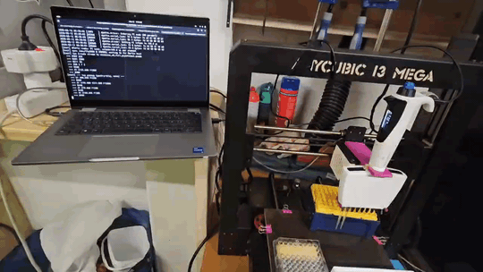

# i3mega-pipettebot

> Turn an **Anycubic i3 Mega** into a sub-$200 disposable-tip pipetting robot
> driven by a **DLAB dPette** electronic pipette and Python.

Marlin / Trigorilla stays unmodified; the print head and PCB are physically
removed from the carriage and the chassis is repurposed as a 3-axis motion
platform with the dPette mounted on the bare carriage
(see [`docs/3d-parts.md`](docs/3d-parts.md)). The pipette is driven over a
separate USB-serial link via
[`dpette-usb-driver`](https://github.com/Lambda-Biolab/dpette-usb-driver).

<p align="center">
  
</p>


[](LICENSE)
[](https://github.com/qte77/i3mega-pipettebot/actions/workflows/ci.yml)
[](https://github.com/qte77/i3mega-pipettebot/actions/workflows/codeql.yml)
[](https://www.codefactor.io/repository/github/qte77/i3mega-pipettebot)
[](https://github.com/qte77/i3mega-pipettebot/actions/workflows/dependabot/dependabot-updates)

> **Status: v0 prototype.** A working aspirate-then-dispense demo over
> hardcoded coordinates. Deck calibration, dPette mount real geometry,
> and firmware modifications are tracked in [open issues](https://github.com/qte77/i3mega-pipettebot/issues);
> short-term agent-to-human handoffs live in [`AGENT_REQUESTS.md`](AGENT_REQUESTS.md).

## Why this matters

A pipetting robot you can build for the price of a 3D printer, with a
disposable-tip workflow and Python control. See
[docs/UserStory.md](docs/UserStory.md) for the target personas,
end-to-end workflows, and what is explicitly out of scope for v0.

| Solution                                | Cost          | Tips        | API control |
|-----------------------------------------|---------------|-------------|-------------|
| **i3 Mega + dPette + this repo**        | **~$200**     | Disposable  | Python      |
| [Science Jubilee][sj] + OT-2 pipette    | ~$900+ build  | Disposable  | Python      |
| [Opentrons OT-2][ot2]                   | from $15,950  | Disposable  | Python      |

[sj]: https://science-jubilee.readthedocs.io/en/latest/
[ot2]: https://opentrons.com/products/ot-2-robot

The Opentrons price is the vendor's published list price (see link).
The Jubilee + OT-2-pipette figure is a community build-cost estimate
anchored at the [Science Jubilee project][sj]; the toolhead family includes
[OT-2 pipettes with disposable tips][sj-pipette].

[sj-pipette]: https://science-jubilee.readthedocs.io/en/latest/building/pipette_tool.html

## Quickstart

Requires [`uv`](https://docs.astral.sh/uv/).

```bash
# Install uv once (if you don't have it):
# curl -LsSf https://astral.sh/uv/install.sh | sh

git clone https://github.com/qte77/i3mega-pipettebot.git
cd i3mega-pipettebot
make setup_dev
make test
```

`make setup_dev` runs `uv sync --extra dev`; `make test` runs the
mocked-serial test suite (no hardware required). `make help` lists every
recipe grouped by section.

### Run the v0 demo (requires hardware)

Two separate guides cover the physical/electrical setup and the
well-origin calibration before you run the demo:

- [`docs/hardware.md`](docs/hardware.md) — cabling, port discovery (CH340 vs CP2102), Marlin firmware sanity check
- [`docs/calibration.md`](docs/calibration.md) — finding well A1 with `M114`, the 9 mm pitch check, where to set the constants

After hookup, sanity-check ports + firmware **before any motion**:

```bash
uv run tools/preflight.py
```

This reads `M115` from Marlin and the EEPROM packet from the dPette;
no motion is sent. Preflight passes when **either** device is found —
the gantry and the pipette are exercised independently in v0.

To chain discovery directly into the next command, use `--export`:

```bash
eval "$(uv run python tools/preflight.py --export)" \
  && uv run python examples/showcase_v0_pipette_sim.py
```

Then the demo. v0 ships hardware examples that drive the gantry
(and, for the canonical end-to-end demo, also the dPette) and tee the
Marlin stream to disk for replay/SD use. **Precondition for all
full-plate demos: REMOVE TIPS from the dPette before running.** Phase
1 issues `G28 X Y Z` — Z homes to its calibrated tip-on-deck zero,
which would drag any mounted tip into the deck.

```bash
# back-well ↔ front-well pipetting cycle (older two-well demo, simulated)
uv run examples/showcase_v0_pipette_sim.py

# Full 96-well plate fill, gantry-only (aspirate/dispense simulated via
# Z dives). Useful for gantry/cabling bring-up without the dPette.
uv run examples/showcase_v0_full_plate.py

# Canonical end-to-end demo — same gantry tour with REAL dPette
# aspirate/dispense (B3 SUCK at reservoir, B3 BLOW at each SBS column).
# Needs both I3MEGA_PORT and PIPETTE_PORT set.
uv run examples/showcase_v0_full_pipettebot.py

# dPette-only bench test — 12 aspirate/dispense cycles, no gantry. Use
# to measure real B3 motor timing. Run with tip in air or over waste.
uv run examples/showcase_v0_full_dpette_cycles.py

# Every v0 showcase (column/dpette-cycles/rows) accepts a TOML experiment
# profile via PIPETTE_PROFILE — drives the cycle count, per-cycle volumes,
# and any pre-mixed reservoir gradient notes. Profile length overrides the
# script's default (NUM_COLUMNS / NUM_CYCLES). See
# `examples/experiment_profiles/` for samples
# (calibration_curve_demo.toml, gradient_reservoir_demo.toml).
PIPETTE_PROFILE=examples/experiment_profiles/calibration_curve_demo.toml \
  uv run examples/showcase_v0_full_dpette_cycles.py
PIPETTE_PORT=/dev/ttyUSB1 \
  PIPETTE_PROFILE=examples/experiment_profiles/calibration_curve_demo.toml \
  uv run examples/showcase_v0_full_pipettebot_rows.py

# Every gantry-using example also accepts MOTION_PROFILE to dial gantry
# accel/jerk between slow / mid / fast (or off to skip the install).
# Default is mid (liquid-handling friendly). See
# `src/pipettebot/motion_profile.py` for the bundled values + semantics.
MOTION_PROFILE=fast NUM_CYCLES=1 \
  uv run examples/showcase_v0_full_pipettebot_rows.py

# Home — full `G28` to (X=0, Y=0, Z=0). Bootstrap installs the same
# liquid-handling motion profile (M203/M201/M204/M205) that every
# showcase_v0_*.py installs, so chaining a home before a tour leaves a
# known motion state. No partial-axis shortcuts.
uv run examples/home_G28_fast.py
```

The full-plate tour's deck layout (slot positions, motion constants,
tour sequence) is the canonical spec — see
[`docs/deck-layout.md`](docs/deck-layout.md).

### Hardware diagnostics (`tools/`)

For headless-gantry bring-up, debugging, and post-removal sanity checks:

| Tool                        | Purpose                                                  |
|-----------------------------|----------------------------------------------------------|
| `tools/preflight.py`        | Port discovery + Marlin/dPette firmware probe.           |
| `tools/diagnose_axis.py`    | Per-axis (`AXIS=X\|Y\|Z`) stepped motion under operator confirmation. Reports `M119` first, never homes. |
| `tools/marlin_repl.py`      | Interactive G-code REPL with built-in command cheat-sheet (`?`). For ad-hoc `M119`, `M999`, `M114`, `M503`, etc. |
| `tools/cad/`                | build123d CAD scripts for printable parts (tip rack, plate holder, dPette cradles, tip ejector, **i3 carriage dPette+ mount**). `make render_parts` generates STL+SVG; `make check_prints` slices via OrcaSlicer (or PrusaSlicer fallback). All hardware measurements consolidated in `tools/cad/measurements.py`. |

See [`docs/marlin-commands.md`](docs/marlin-commands.md) for the full
G/M-code reference and i3 Mega coordinate orientation.

Expected behavior: home → bed sweeps to back well → 5 cm Z plunger
stroke → bed sweeps to front well → another stroke → home.

## Architecture (v0)

```text
examples/showcase_v0_pipette_sim.py
        │
        ▼
raw serial @ 250000 baud  ──► /dev/cu.usbserial-*  (Marlin, G-code)
        │
        └─ tee G-code stream ──► OUTPUT_GCODE file (replay / SD)
```

In v0 the dPette is wired in via `dpette.DPetteDriver`.
`showcase_v0_full_pipettebot.py` runs the full plate fill end-to-end —
gantry transit + real B3 SUCK/BLOW at the bottom of each dive.
`showcase_v0_full_plate.py` keeps the gantry-only path (plunger
simulated via Z) for bring-up without the pipette. Firmware-side
M820 pass-through is still in [`AGENT_REQUESTS.md`](AGENT_REQUESTS.md)
but no longer required for end-to-end pipetting.

Five modules: `gantry.py` (G-code wrapper), `bot.py` (composer),
`experiment_profile.py` (TOML experiment-profile loader; see
[`examples/experiment_profiles/`](examples/experiment_profiles/)),
`motion_profile.py` (bundled SLOW/MID/FAST gantry-tuning factors;
`MOTION_PROFILE` env selects), and `__init__.py` (re-exports). No
deck library, no safety limits, no calibration in v0 — the caller
passes raw `(x, y, z)`.

## Development

| Recipe                  | What it runs                                                  |
|-------------------------|---------------------------------------------------------------|
| `make setup_uv`         | install uv (idempotent — skips if already on PATH)            |
| `make setup_prod`       | `uv sync` (runtime deps only — pyserial + dpette)             |
| `make setup_dev`        | `uv sync --extra dev` (runtime + ruff/mypy/pytest/complexipy/hypothesis) |
| `make setup_cad`        | `uv sync --extra cad` (build123d)                             |
| `make setup_slicer`     | probe for OrcaSlicer (preferred) or PrusaSlicer (fallback)    |
| `make setup_all`        | `setup_dev` + `setup_cad` + best-effort slicer/diagramforge   |
| `make validate`         | `ruff format --check` + `ruff check` + `mypy --strict` + `pytest -m "not hardware"` |
| `make quick_validate`   | `ruff check` + `mypy` only (no tests)                         |
| `make lint`             | `ruff check` + `mypy --strict`                                |
| `make lint_fix`         | `ruff format` + `ruff check --fix`                            |
| `make test`             | `pytest -v` (hardware tests excluded via `pyproject.toml`)    |
| `make check_complexity` | `complexipy src/pipettebot/` (max 15)                         |
| `make check_links`      | `lychee` against the repo (config in `.lychee.toml`)          |
| `make check_docs`       | `markdownlint-cli2 "**/*.md"`                                 |
| `make render_parts`     | build123d → STL/SVG (driven by `tools/cad/parts.json`)        |
| `make check_prints`     | headless slice via `tools/slicer/validate.py --all`           |
| `make render_all`       | `render_parts` + `check_prints` (full CAD-to-slicer gate)     |

Recipes prefer the local `.venv/bin/<tool>` binary if installed, else fall
back to `uv run`. On read-only hosts where `uv run` can't write to
`~/.cache/uv`, run `make setup_dev` first (which materialises the venv)
or set `UV_CACHE_DIR=$TMPDIR/uv-cache`.

The `setup_*` recipes pass `--inexact` to `uv sync` so they are
**additive**: running `setup_dev` after `setup_cad` keeps `build123d`
installed (and vice versa). Without `--inexact`, `uv sync` is exact
and uninstalls anything outside the requested extras.

Hardware tests are gated by `@pytest.mark.hardware`:

```bash
uv run pytest -m hardware
```

## Architecture decision: why PC-as-host (no firmware mods)

Marlin runs unmodified. Pipetting cycles are slow (seconds per move,
seconds per aspirate); USB-serial round-trip latency (~20–50 ms) is
inconsequential. Firmware integration (Stage 1 config patch, Stage 2
UART tap to dPette) is documented in [AGENT_REQUESTS.md](AGENT_REQUESTS.md)
but deliberately **not** part of v0.

## Documentation

- [docs/UserStory.md](docs/UserStory.md) — user personas, target workflows, scope and acceptance criteria
- [docs/hardware.md](docs/hardware.md) — i3 Mega + dPette wiring, port discovery, firmware sanity check, dPette+ specs
- [docs/calibration.md](docs/calibration.md) — well-A1 origin procedure, 9 mm pitch check
- [docs/deck-layout.md](docs/deck-layout.md) — deck slot extents, motion constants, four-phase tour sequence (canonical spec for `showcase_v0_full_plate.py`)
- [docs/marlin-commands.md](docs/marlin-commands.md) — Marlin G/M-code reference + i3 Mega coordinate orientation
- [docs/3d-parts.md](docs/3d-parts.md) — CAD pipeline design rationale, payload + Z envelope math, SBS labware reference
- [docs/sbc-deployment.md](docs/sbc-deployment.md) — Path 2 (Single-Board Computer on-printer) deployment
- [docs/adr/](docs/adr/) — architectural decision records
- [AGENTS.md](AGENTS.md) — agent rules, decision framework, architecture
- [AGENT_LEARNINGS.md](AGENT_LEARNINGS.md) — gotchas as we discover them
- [AGENT_REQUESTS.md](AGENT_REQUESTS.md) — short-term agent-to-human handoffs
- [CONTRIBUTING.md](CONTRIBUTING.md) — dev workflow
- [CHANGELOG.md](CHANGELOG.md) — version history

## License

Apache-2.0 — see [LICENSE](LICENSE) and [NOTICE](NOTICE).
